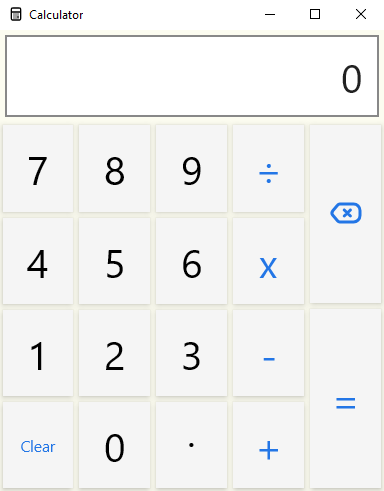

# Compose Multiplatform Calculator

A [Compose Multiplatform](https://www.jetbrains.com/lp/compose/) demo app with support for Windows and Android.



Documentation available in the following [Getting started](https://simply-how.com/getting-started-with-compose-multiplatform) with Compose Multiplatform article.

## Desktop

To build and run the development version of the desktop app, use the run configuration from the run widget
in your IDE's toolbar or run it directly from the terminal:
- on macOS/Linux/Powershell
  ```shell
  ./gradlew :composeApp:hotRunJvm --auto
  ```
- on Windows Batch
  ```shell
  .\gradlew.bat :composeApp:hotRunJvm --auto
  ```

To generate an installer for your current Operating System, run from the terminal:

- on macOS/Linux/Powershell
  ```shell
  ./gradlew packageDistributionForCurrentOS
  ```
- on Windows Batch
  ```shell
  .\gradlew.bat packageDistributionForCurrentOS
  ```

## Android
- Use IDE to run the project from the MainActivity (See the last paragraph of [Getting started](https://simply-how.com/getting-started-with-compose-multiplatform#section-2) with Compose Multiplatform).
- Use IDE to build and package your Android project (Build menu).

## Common commands

### macOS/Linux/Powershell

  ```shell
  # Run application with hot reload
  ./gradlew :composeApp:hotRunJvm --auto
  ```
  ```shell
  # Basic build (includes resources generation), without Android specific build
  ./gradlew :composeApp:jvmJar
  ```
  ```shell
  # Full build, including Android
  ./gradlew build
  ```
  ```shell
  # Generate lint report
  ./gradlew :composeApp:lint
  ```
  ```shell
  # Generate installer
  ./gradlew packageDistributionForCurrentOS
  ```
  ```shell
  # Package .jar that can be run with: java -jar <jarName>
  ./gradlew :composeApp:packageUberJarForCurrentOS
  ```
  ```shell
  # Deletes the build directory
  ./gradlew :composeApp:clean
  ```
  ```shell
  # Displays the tasks runnable from project ':composeApp'
  ./gradlew :composeApp:tasks
  ```

### Windows batch
  ```shell
  # Run application with hot reload
  .\gradlew.bat :composeApp:hotRunJvm --auto
  ```
  ```shell
  # Basic build (includes resources generation), without Android specific build
  .\gradlew.bat :composeApp:jvmJar
  ```
  ```shell
  # Full build, including Android
  .\gradlew.bat build
  ```
  ```shell
  # Generate lint report
  .\gradlew.bat :composeApp:lint
  ```
  ```shell
  # Generate installer
  .\gradlew.bat packageDistributionForCurrentOS
  ```
  ```shell
  # Package .jar that can be run with: java -jar <jarName>
  .\gradlew.bat :composeApp:packageUberJarForCurrentOS
  ```
  ```shell
  # Deletes the build directory
  .\gradlew.bat :composeApp:clean
  ```
  ```shell
  # Displays the tasks runnable from project ':composeApp'
  .\gradlew.bat :composeApp:tasks
  ```
